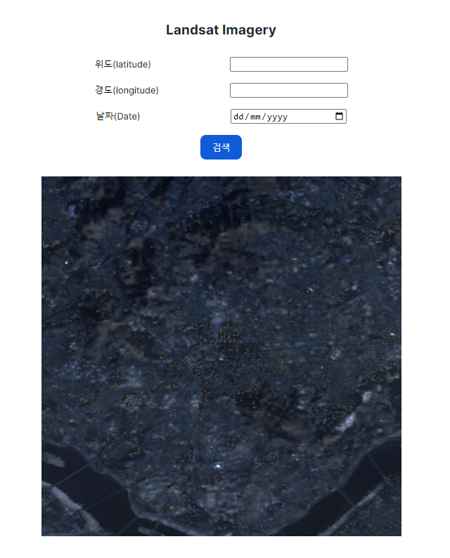

# 위성사진(LandSat Iamgery) 조회

### 개요
이 프로젝트는 사용자가 경도, 위도, 날짜를 입력하면 해당 위치의 Landsat 사진을 보여주는 간단한 페이지입니다. NASA의 Landsat imagery를 제공하는 API를 사용합니다.

### 사용 API
- [NASA Landsat Imagery API](https://api.nasa.gov/)

### 기능
- 경도, 위도 및 날짜를 입력하여 해당 위치의 Landsat 사진을 조회
- API 응답으로 받은 이미지를 화면에 표시

<div style="text-align: center;">
  
</div>


### 설치 및 실행 방법

1. **저장소 클론**

    ```bash
    git clone https://github.com/Jeehay28/react-app-02
    cd react-app-02
    ```

2. **필요한 패키지 설치**

    ```bash
    npm install
    ```

3. **환경 변수 설정**

    [NASA API key](https://api.nasa.gov/)를 발급 받습니다.
    프로젝트 루트 디렉토리에 `.env` 파일을 생성하고 다음 내용을 추가합니다.

    ```env
    VITE_NASA_API_KEY=your_nasa_api_key_here
    ```

4. **개발 서버 실행**

    ```bash
    npm run dev
    ```

5. **웹 브라우저에서 확인**
    개발 서버가 실행되면, 웹 브라우저에서 `http://localhost:5173/`을 열어 페이지를 확인할 수 있습니다.

### 사용 방법

1. 페이지가 열리면, 경도와 위도, 그리고 날짜를 입력합니다.
2. "조회" 버튼을 클릭하면 입력한 위치와 날짜의 Landsat 사진이 화면에 표시됩니다.

### 주요 파일 설명

- `src/components/Imagery.tsx`: 어플리케이션의 메인 컴포넌트로, 경도, 위도, 날짜 입력 폼을 포함하고 있습니다. Landsat 사진을 조회하고 표시하는 주요 컴포넌트입니다.